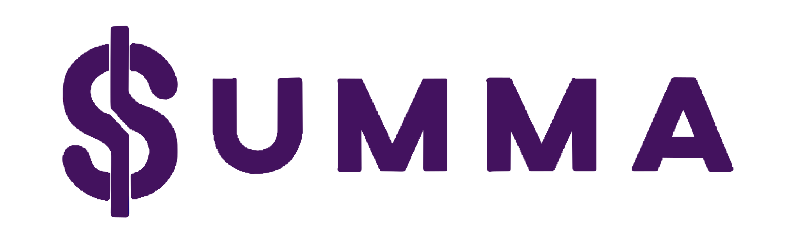
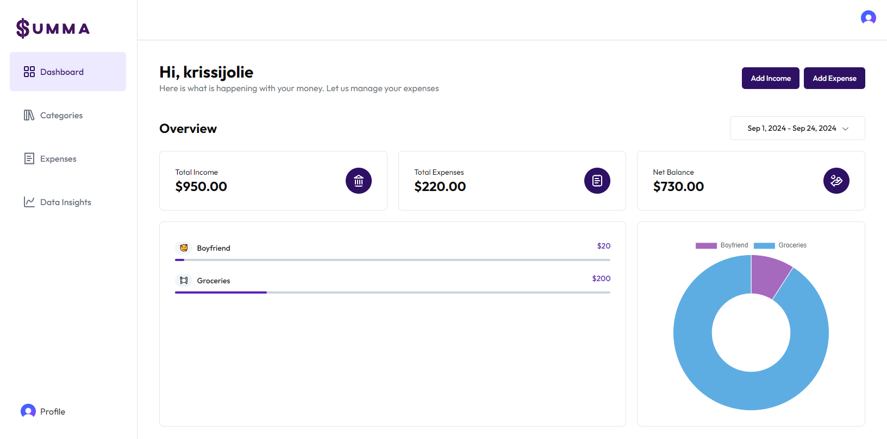
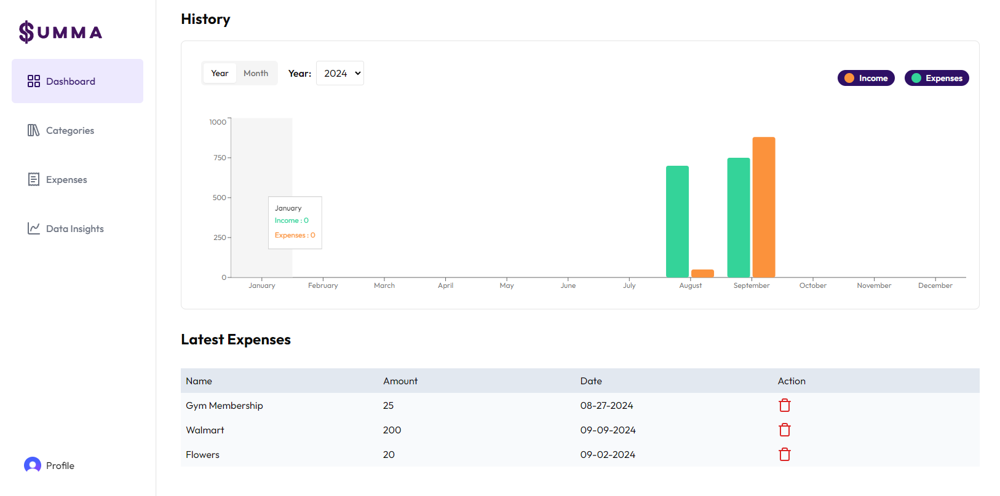

<a id="readme-top"></a>

<!-- PROJECT LOGO -->
<br />
<div align="center">
  <a href="https://github.com/Krisces/Summa">
    
  </a>

  <h3 align="center">Summa</h3>

  <p align="center">
    A Personal Finance Website to Track Your Expenses!
    <br />
    <a href="https://github.com/Krisces/Summa"><strong>Explore the docs »</strong></a>
    <br />
    <br />
    <a href="https://summa-krisces-projects.vercel.app/">View Demo</a>
    ·
    <a href="https://github.com/Krisces/Summa/issues/new?labels=bug&template=bug-report---.md">Report Bug</a>
    ·
    <a href="https://github.com/Krisces/Summa/issues/new?labels=enhancement&template=feature-request---.md">Request Feature</a>
  </p>
</div>


<!-- TABLE OF CONTENTS -->
<details>
  <summary>Table of Contents</summary>
  <ol>
    <li>
      <a href="#about-the-project">About The Project</a>
      <ul>
        <li><a href="#built-with">Built With</a></li>
      </ul>
    </li>
    <li>
      <a href="#getting-started">Getting Started</a>
      <ul>
        <li><a href="#prerequisites">Prerequisites</a></li>
        <li><a href="#installation">Installation</a></li>
      </ul>
    </li>
    <li><a href="#usage">Usage</a></li>
    <li><a href="#roadmap">Roadmap</a></li>
    <li><a href="#contact">Contact</a></li>
  </ol>
</details>


<!-- ABOUT THE PROJECT -->
## About The Project

[](https://summa-krisces-projects.vercel.app/)
[](https://summa-krisces-projects.vercel.app/)

Inspired by my mother’s budgeting habits in Germany, where cash transactions are more common, I developed this project to assist individuals like her in tracking their finances. Growing up, I witnessed her diligently manage her budget with receipts, and I wanted to create a digital solution to simplify this process.

This application aims to empower users by providing a secure login/signup feature via Clerk and a user-friendly dashboard. Once logged in, users can add income and expenses, selecting a date range of up to one month to view their total income, total expenses, and net balance.

Key features include:

* Expense Categorization: Users can view expenses by category, represented visually with progress bars that fill as spending increases relative to total expenses.
* Data Visualization: A percentage chart displays spending habits across categories (e.g., groceries 60%, relationships 10%, gym 30%). Additionally, a bar chart contrasts total income and expenses over a selected month or across a year.
* Latest Expenses: Users can quickly access their most recent expenses.
* Category Management: Users can create categories with specific emojis and names, set optional budget amounts, and view usage against the budget. Clicking on a category leads to a detailed view of related expenses, with options to edit or delete expenses.
* Data Analytics: A dedicated tab will feature machine learning capabilities to predict spending habits and provide forecasts based on historical data. For instance, it will anticipate higher spending during the Christmas season, helping users save accordingly.

This project aims to provide a comprehensive budgeting tool that not only tracks expenses but also leverages data analytics to enhance financial planning.

<p align="right">(<a href="#readme-top">back to top</a>)</p>


### Built With

* [![Next][Next.js]][Next-url]
* [![React][React.js]][React-url]
* Drizzle-ORM
* Tailwind CSS
* Clerk

<p align="right">(<a href="#readme-top">back to top</a>)</p>


<!-- GETTING STARTED -->
## Getting Started

This is how to set up the project locally. Follow these simple steps to get a local copy up and running.

### Prerequisites

You need to have npm installed on your machine. You can install it using the following command:
  ```sh
  npm install npm@latest -g
  ```

### Installation

Follow these steps to install and set up your app:

1. Clone the repo
   ```sh
   git clone https://github.com/Krisces/Summa.git
   ```
2. Navigate into the project directory:
   ```sh
   cd Summa
   ```
3. Install NPM packages:
   ```sh
   npm install
   ```
4. Change the git remote URL to avoid accidental pushes to the base project:
   ```sh
   git remote set-url origin github_username/repo_name
   git remote -v # confirm the changes
   ```
5. Run the development server:
  ```bash
  npm run dev
  ```
6. Open [http://localhost:3000](http://localhost:3000) with your browser to see the result.

<p align="right">(<a href="#readme-top">back to top</a>)</p>


<!-- ROADMAP -->
## Roadmap

- [x] Improve the dashboard with visualizations for better financial insights
- [x] Enhance the categories page with additional features (e.g., setting recurring budgets)
- [ ] Add more detailed expense tracking options
- [ ] Expand data analytics features with machine learning for spending predictions


See the [open issues](https://github.com/othneildrew/Best-README-Template/issues) for a full list of proposed features (and known issues).

<p align="right">(<a href="#readme-top">back to top</a>)</p>


<!-- CONTACT -->
## Contact

Kristin Boeckmann - kristinboeckmann3@gmail.com
Project Link: [https://github.com/Krisces/Summa](https://github.com/Krisces/Summa)

<p align="right">(<a href="#readme-top">back to top</a>)</p>


